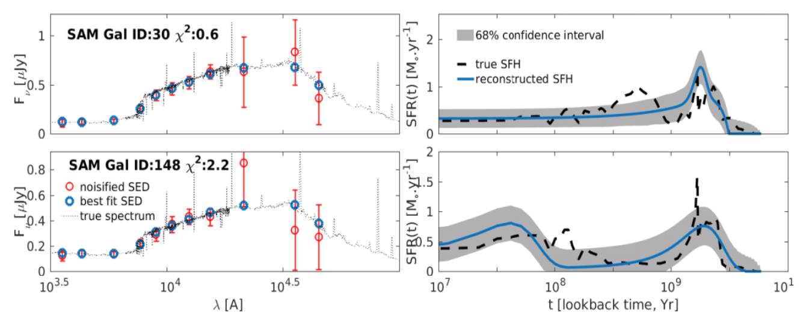
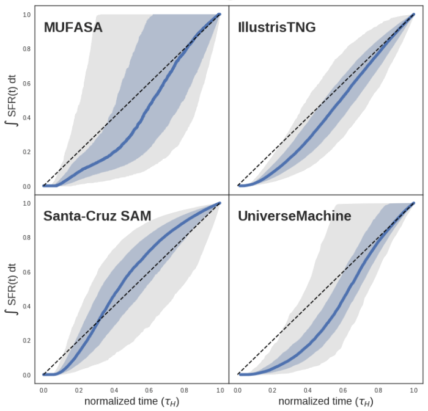
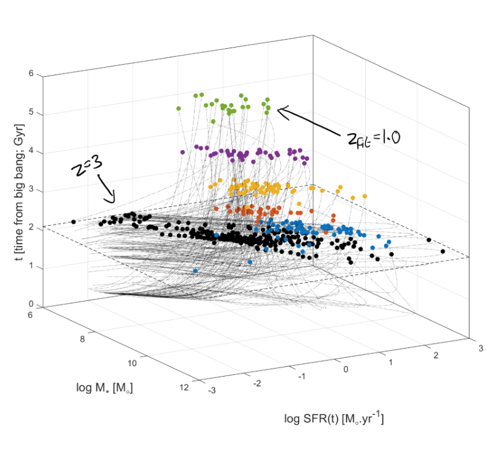
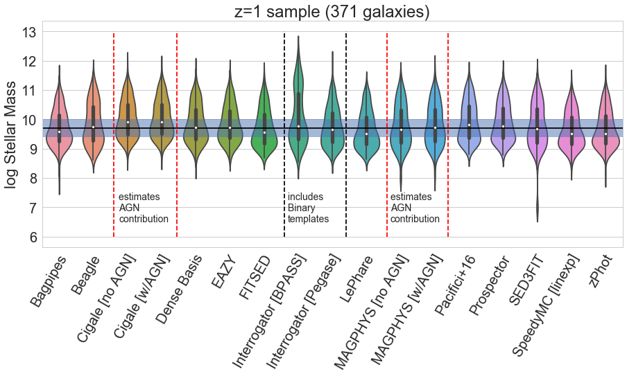
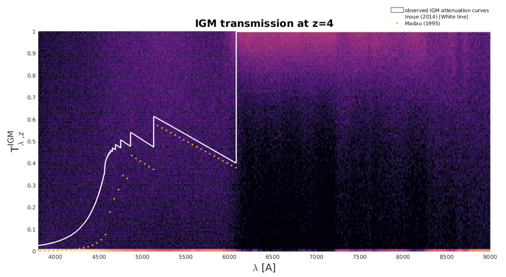
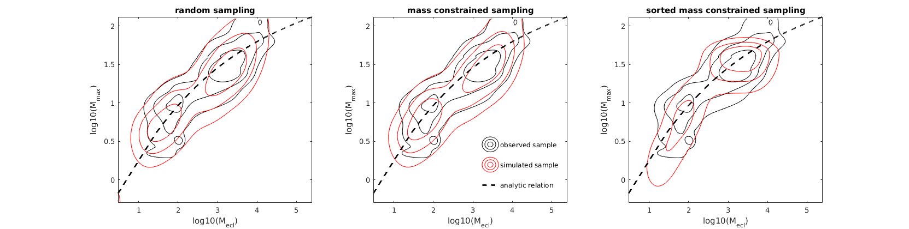

***

# Dense Basis SED fitting

Reconstructing the star formation histories (SFHs) of individual galaxies with uncertainties from multiband photometry. The current version uses Gaussian Processes along with a flexible parametrization to reconstruct smooth SFHs independent of the choice of a functional form.

The initial version of this methodology tests different parametric forms and their combinations where statistically favorable to reconstruct the SFHs of galaxies with uncertainties. Published as [Iyer & Gawiser (2017) ApJ 838 127](https://doi.org/10.3847/1538-4357/aa63f0) and available on ArXiv at [1702.04731](https://arxiv.org/abs/1702.04371).

An improved version of this methodology goes beyond parametric forms altogether, and uses Gaussian Processes in SFH space to create smooth, nonparametric reconstructions of galaxy SFHs. This has been applied to all five CANDELS fields to reconstruct the SFHs of nearly 50,000 galaxies from their broadband photometry. Current efforts are looking at correlating the SFHs of individual galaxies with other factors that trace galaxy growth, such as their environments and morphologies. For more details on use cases, applications and current developments email me, or read the paper on ArXiv -> [1901.02877](https://arxiv.org/pdf/1901.02877).

***

# The Diversity of SFHs across different simulations

Robustly analyzing the SFHs of galaxies from different simulations across a range of timescales to understand what sets the diversity of SFHs within a simulation and the impact of different physics recipes across different simulations. This research is based on  work done during the Kavli Summer Program in Astrophysics (KSPA) 2018.

***

# Probing the low-stellar mass high-redshift regime of the SFR-M* correlation

The SFR-M* correlation is an observed correlation between the stellar masses and star formation rates of galaxies that spans a nearly six orders of magnitude in stellar mass across a wide range of redshifts. I use the SFHs of nearly 20,000 galaxies from the CANDELS/GOODS-South field to explore whether this correlation exists in the regime of distant, low-mass stars that are too faint to probe directly.

You can find the paper on ArXiv @ [1809.04099](https://arxiv.org/abs/1809.04099).

***

# Comparing different SED fitting codes

This project comes out of a desire to better understand the effects of different modeling techniques and parameter assumptions used in spectral energy distribution (SED) fitting codes, and better quantify the inter-code variability using the results of estimating stellar masses, star formation rates, and dust attenuation on a common sample of galaxies using 14 different SED fitting codes. This research is the result of a conference at UC Riverside - the art of measuring the physical parameters of galaxies.

***

# The effects of IGM absorption stochasticity on photometric redshift estimation with LSST

Based on work done as part of the LSST-DESC photo-z working group, this project aims to quantify the effects of stochastic IGM absorption - absorption of light at different wavelengths due to clouds of diffuse hydrogen and helium that lie along lines of sight from distant galaxies - on estimating how far away these galaxies are. We find that while stochastic absorption can introduce significant biases in estimating photometric redshifts (on the order of 10%), this can be accounted for by devloping and using better models of IGM absorption. 

***

# The relation between the mass of a star cluster and its most massive star

Studying the relation between the mass of a star cluster and its most massive star has implications for the IGIMF, by allowing us to discriminate between different mechanisms by which star formation is self regulated. Work with Elaad Applebaum based on a project for Physics 689 - Data Mining and Statistics in Astrophysics.

